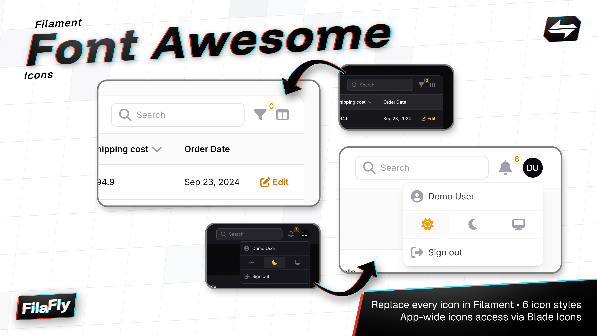

<p class="filament-hidden" align="center">
    
</p>

# Filament FontAwesome Icons

A Font Awesome icon set implementation for Filament 3.x, providing a comprehensive set of Font Awesome icons that seamlessly integrate with Filament's interface.

## Installation

You can install the package via composer:

```bash
composer require filafly/filament-font-awesome-icons
```

After the package is installed, you must register the plugin in your Filament Panel provider:

```php
use Filafly\FilamentFontAwesomeIcons\FontAwesomeIcons;

public function panel(Panel $panel): Panel
{
    return $panel
        ->plugins([
            FontAwesomeIcons::make(),
        ]);
}
```

## Icon Styles

Font Awesome icons come in multiple styles that you can switch between. Available styles include:

- Classic Solid (default)
- Classic Regular
- Classic Light
- Classic Thin
- Duotone Solid
- Sharp Solid
- Sharp Regular
- Sharp Light
- Sharp Thin
- Sharp Duotone Solid
- Brands

You can change the style using the following methods:

```php
FontAwesomeIcons::make()->classicSolid(); // (default)
FontAwesomeIcons::make()->classicRegular();
FontAwesomeIcons::make()->classicLight();
FontAwesomeIcons::make()->classicThin();
FontAwesomeIcons::make()->duotoneSolid();
FontAwesomeIcons::make()->sharpSolid();
FontAwesomeIcons::make()->sharpRegular();
FontAwesomeIcons::make()->sharpLight();
FontAwesomeIcons::make()->sharpThin();
FontAwesomeIcons::make()->sharpDuotoneSolid();
FontAwesomeIcons::make()->brands();
```

## Override Specific Icons
If you need to override certain icons to use a different style, you can use either icon aliases or direct icon names.

### Using Icon Aliases
Use the `overrideStyleForAlias` method with a [Filament Icon Alias](https://filamentphp.com/docs/3.x/support/icons#available-icon-aliases). This method works with either a single icon key (string) or multiple icon keys (array).

```php
// Override a single icon key
FontAwesomeIcons::make()->overrideStyleForAlias('tables::actions.filter', 'classicThin');

// Override multiple icon keys at once
FontAwesomeIcons::make()->overrideStyleForAlias([
    'tables::actions.filter',
    'actions::delete-action',
], 'classicThin');
```

### Using Icon Names
Use the `overrideStyleForIcon` method with the actual FontAwesome icon name. Like the alias method, this works with either a single icon name or multiple names.

```php
// Override a single icon
FontAwesomeIcons::make()->overrideStyleForIcon('font-awesome-user', 'classicThin');

// Override multiple icons at once
FontAwesomeIcons::make()->overrideStyleForIcon([
    'font-awesome-user',
    'font-awesome-caret-up',
], 'classicThin');
```

## Free vs Paid
If you are using the free version of Font Awesome, you'll be limited in your style choices since the free version only includes a limited number of icons. To handle this gracefully, you can add the `free()` method to the plugin which will automatically fallback to Classic Solid for any icons that don't exist in Classic Regular style:

## License
The MIT License (MIT). Please see [License](LICENSE.md) for more information.